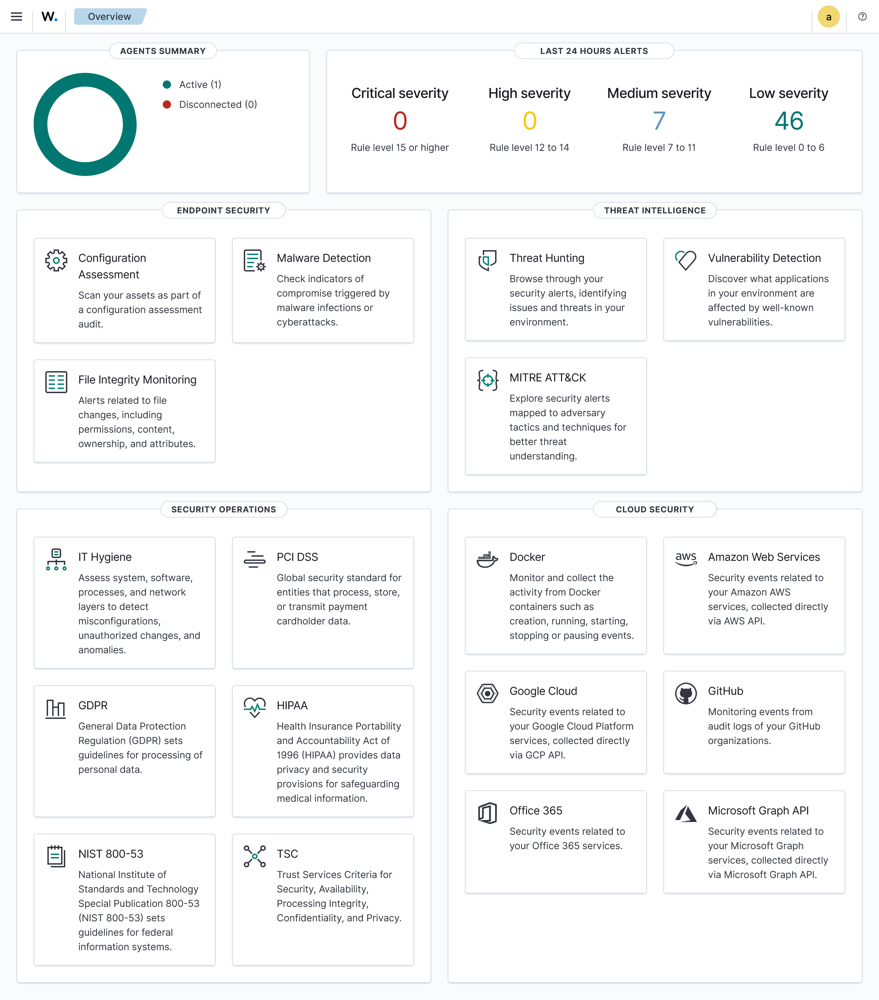
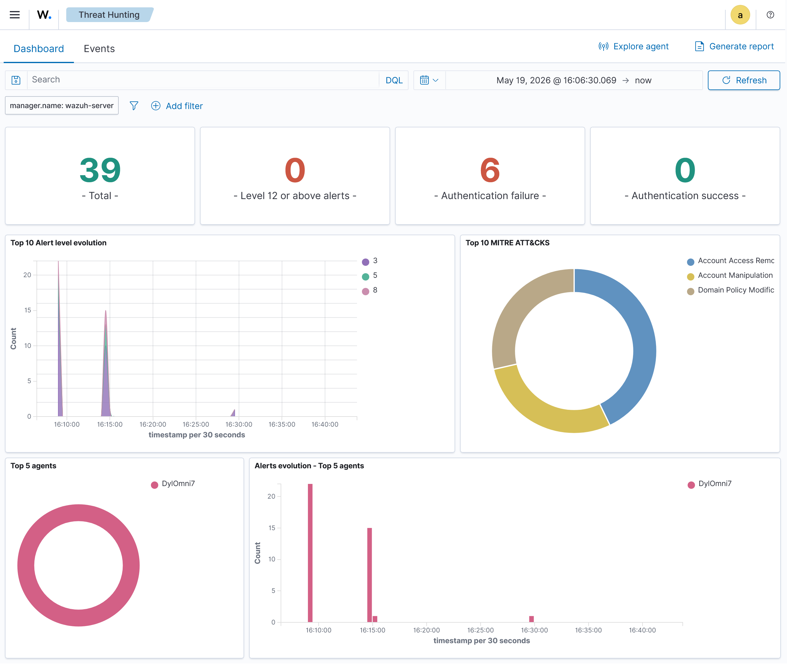

# Wazuh Windows SOC Lab

## Project Status

**In Progress**

This project is a home SOC-style lab using Wazuh to monitor a Windows endpoint and test different detection scenarios.

The lab is currently functional. A Windows endpoint has been connected to Wazuh, failed login alerts have been captured, and additional detection scenarios are being added.

---

## Project Overview

This project demonstrates practical blue team and SOC analyst skills using a Wazuh SIEM lab.

The goal is to practise:

- SIEM setup and navigation
- Endpoint monitoring
- Windows log analysis
- Security alert investigation
- Detection scenario testing
- SOC-style documentation

---

## Lab Architecture

```text
Windows 11 Endpoint
        ↓
Wazuh Agent
        ↓
Wazuh Manager
        ↓
Wazuh Dashboard / Threat Hunting
```

---

## Tools Used

| Tool | Purpose |
|---|---|
| Wazuh | SIEM and security monitoring platform |
| VirtualBox | Running the Wazuh virtual machine |
| Windows 11 | Monitored endpoint |
| Wazuh Agent | Forwarding endpoint logs to Wazuh |
| Windows Event Logs | Source of authentication and system events |

---

## Detection Scenarios

| Scenario | Status | Description | Report |
|---|---|---|---|
| Failed Windows Login Detection | Completed | Generated incorrect Windows login attempts and confirmed Wazuh detected authentication failure alerts. | [View Report](reports/failed-login-detection.md) |
| File Integrity Monitoring | Planned | Testing whether Wazuh detects changes to monitored files on the Windows endpoint. | Coming soon |
| Agent / Service Monitoring | Planned | Reviewing Wazuh agent and Windows service-related events. | Coming soon |

---

## Completed Scenario: Failed Windows Login Detection

The first detection scenario tested whether Wazuh could detect failed Windows login attempts.

To generate the event, I intentionally entered an incorrect Windows password multiple times on the monitored endpoint.

Wazuh detected the activity and generated alerts with the rule description:

```text
Logon Failure - Unknown user or bad password
```

### Alert Summary

| Field | Value |
|---|---|
| SIEM | Wazuh |
| Endpoint | Windows 11 |
| Agent Name | DyIOmni7 |
| Alert Type | Failed login |
| Rule Description | Logon Failure - Unknown user or bad password |
| Rule Level | 5 |
| Rule ID | 60122 |

Full write-up: [Failed Windows Login Detection Report](reports/failed-login-detection.md)

---

## Screenshots

### Agent Connected



### Threat Hunting Dashboard



### Failed Login Alerts


### Alert Document Details


---

## What This Project Demonstrates

This project demonstrates that I can:

- Deploy a basic SIEM lab environment
- Connect a Windows endpoint to a SIEM
- Generate controlled security events
- Investigate alerts in Wazuh Threat Hunting
- Interpret alert metadata such as rule ID, rule level, agent name, and event details
- Document findings in a clear SOC-style format

---

## Limitations

This project is being completed in a local lab environment. The detected activity was intentionally generated for testing and was not caused by a real attacker.

The current completed detection scenario focuses on failed local Windows login attempts. Additional scenarios will be added to make the lab more complete.

---

## Next Steps

Planned improvements:

- Add a full File Integrity Monitoring detection scenario
- Add screenshots for File Integrity Monitoring
- Add a File Integrity Monitoring report
- Add an Agent / Service Monitoring report
- Test repeated failed logins as a brute-force-style simulation
- Improve documentation and screenshots as the lab develops
