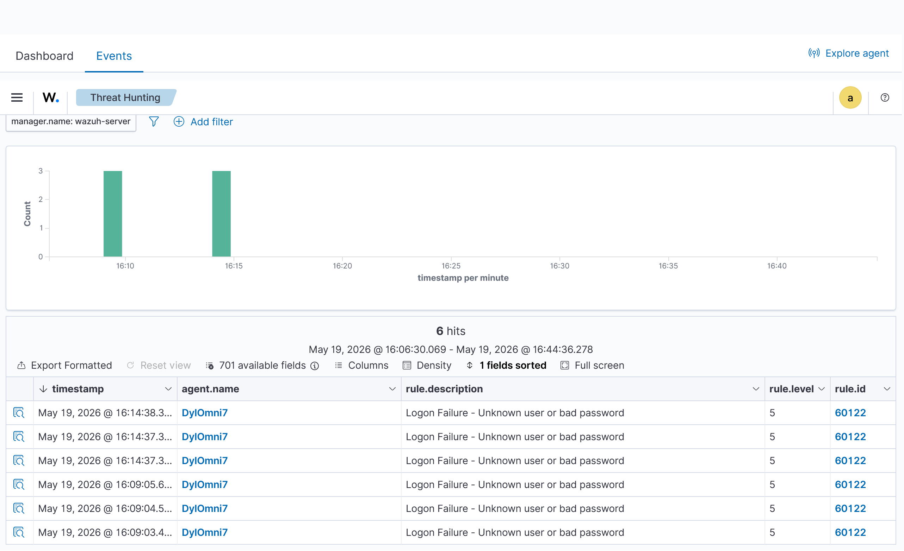
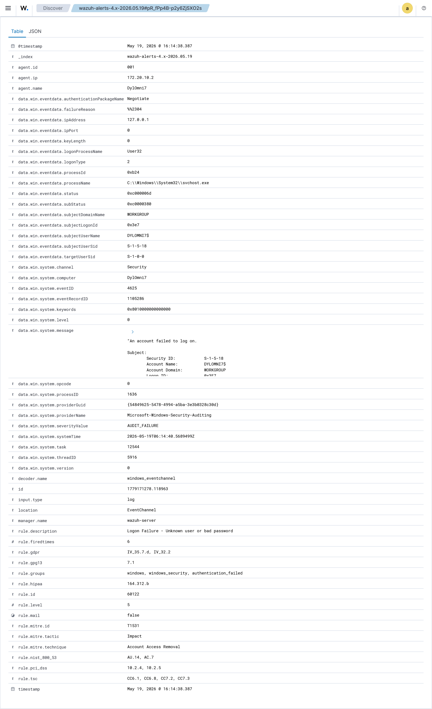

# Wazuh Windows SOC Lab

## 1. Project Status

**In Progress**

This lab is currently working. I have connected a Windows endpoint to Wazuh and captured failed login alerts. I am still adding more detection scenarios and documentation.

---

## 2. What This Project Is

This is a home cyber security lab using **Wazuh SIEM** to monitor a Windows 11 computer.

The goal is to practise basic SOC analyst skills, including:

- Monitoring endpoint activity
- Reviewing security alerts
- Analysing failed login attempts
- Documenting findings

---

## 3. Tools Used

| Tool | Purpose |
|---|---|
| Wazuh | SIEM/security monitoring platform |
| VirtualBox | Runs the Wazuh virtual machine |
| Windows 11 | Endpoint being monitored |
| Wazuh Agent | Sends Windows logs to Wazuh |
| Windows Event Logs | Source of login/security events |

---

## 4. What I Have Done So Far

- Imported and started the Wazuh OVA in VirtualBox
- Opened the Wazuh dashboard locally
- Installed the Wazuh agent on my Windows machine
- Configured the agent to connect to the Wazuh manager
- Confirmed the endpoint appears as active in Wazuh
- Purposely entered the wrong Windows password
- Found the failed login alerts in Wazuh Threat Hunting

---

## 5. Detection Test: Failed Windows Login

To test the lab, I intentionally entered an incorrect Windows password multiple times.

Wazuh detected this and created alerts with the description:

```text
Logon Failure - Unknown user or bad password
```

### Alert Details

| Field | Value |
|---|---|
| SIEM | Wazuh |
| Endpoint | Windows 11 |
| Agent Name | DyIOmni7 |
| Alert Type | Failed login |
| Rule Description | Logon Failure - Unknown user or bad password |
| Rule Level | 5 |
| Rule ID | 60122 |

---

## 6. Screenshots

### Agent Connected


### Threat Hunting Dashboard


### Failed Login Alerts



### Alert Details



---

## 7. What This Shows

This project shows that I can set up a SIEM lab, connect a Windows endpoint, generate a security event, and investigate the alert inside Wazuh.

This is relevant to SOC analyst work because failed login attempts can indicate password guessing, brute-force attempts, or unauthorised access attempts.

---

## 8. Next Steps

- Add a full incident report
- Test more failed login attempts as a brute-force simulation
- Explore file integrity monitoring
- Explore vulnerability detection
- Add more screenshots and notes
